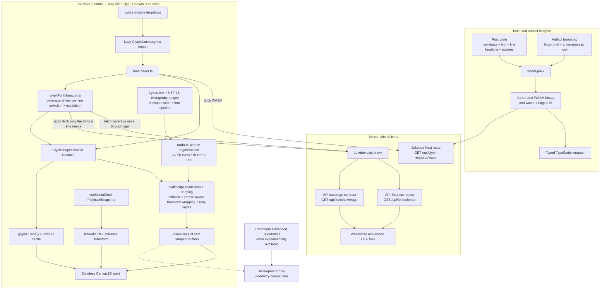

# Glyph Canvas (PoC)

"Glyph Canvas (PoC)" is an experimental lyrics renderer in `@lyricova/jukebox`
that ships its own text shaping (via a bundled WASM crate) instead of relying
on the DOM/CSS text layout every other lyrics module uses. It exists to
prototype **per-shaped-cluster animation** (karaoke fill, entrance transitions,
ruby placement) at a granularity the DOM does not expose. This page is the
single entry point for the PoC: the July 2026 platform conclusion that
motivated it, the architecture that was chosen instead, and where to find the
deeper docs, commands, and known limitations. It intentionally stays short and
links out rather than repeating the detail already written elsewhere.

## Select it

Open the jukebox player, use the lyrics-module dropdown (top of the lyrics
view, rendered by `LyricsSwitchButton`), and pick **"Glyph Canvas (PoC)"** from
the list (`MODULE_LIST` in `src/app/(public)/page.tsx`). The module is loaded
via `next/dynamic({ ssr: false })` so neither the WASM shaper nor its fonts are
fetched until it's actually selected.

## Platform conclusion (July 2026)

**There is no stable, cross-browser native API that exposes shaped-glyph-cluster
geometry suitable for per-cluster animation.** Standard Canvas2D `TextMetrics`
and DOM text layout only report whole-string metrics; `Intl.Segmenter` gives
grapheme/word boundaries with no OpenType shaping, ligature clustering, bidi
resolution, or per-cluster positions.

The closest native candidate, Chromium's **Enhanced Canvas TextMetrics**
(`CanvasRenderingContext2D.measureText().getTextClusters()`), does expose
per-cluster boxes, but as of July 2026 it is a **Chromium-only origin trial**
(shipped from around Chrome 144), not implemented in Firefox or WebKit/Safari,
and not enabled by default — so it cannot be a production dependency. Primary
sources:

- Explainer: <https://github.com/fserb/canvas2D/blob/master/spec/enhanced-textmetrics.md>
- Chrome Status entry (origin trial tracking): <https://chromestatus.com/feature/6709415227639808>

Accordingly, this codebase wires the API up only as a **development-only
diagnostic**, never a rendering dependency: `enhancedCanvasTextMetricsAdapter.ts`
adapts `getTextClusters()` when present, and `glyphNativeDiagnostics.ts`
cross-checks its cluster geometry against the WASM shaper's own output,
reporting `"unavailable"` (not an error) on any browser that lacks it — see the
doc comments on both files. Production rendering never touches this API.

## Selected architecture: rustybuzz + WASM

Given no native option, the PoC ships its own shaping/layout via a Rust/
wasm-bindgen crate, `@lyricova/glyph-renderer`, built on
[`rustybuzz`](https://github.com/harfbuzz/rustybuzz). The full rationale —
including why the evaluation-brief's first candidate,
[`cosmic-text`](https://github.com/pop-os/cosmic-text), couldn't meet the
required contract (no way to express explicit direction/script/language/
feature/variation overrides in its public `Attrs` API) — is written up in
[`packages/glyph-renderer/README.md` § "Why `rustybuzz`, not
`cosmic-text`"](../packages/glyph-renderer/README.md#why-rustybuzz-not-cosmic-text).
Two other options were considered and rejected without a full build-out:

- **CanvasKit** (Skia's WASM build) ships a full alternate rendering pipeline
  (its own canvas/GPU backend), not a shaping library — adopting it would mean
  replacing the Canvas2D/DOM stack every other lyrics module in this repo
  already uses, for a multi-megabyte WASM binary several times the size of
  the ~830 KB `rustybuzz`-based module (see measured sizes below). It didn't
  fit the brief's "thin, embeddable shaping library" contract.
- **Native platform text APIs** were ruled out for the reason above: nothing
  cross-browser exposes shaped-cluster geometry to animate against.

## Architecture flow



The WASM package owns typography and returns deterministic geometry; it does
not own playback or animation time. Jukebox converts each
`PlaybackSnapshot` into cluster paint state and redraws the cached layout, so
seeks, pauses, playback-rate changes, and late readiness all use the same
media clock. The only endpoint that remains Next-local is the ABI-coupled WASM
binary; font assets belong to `packages/api` and travel through Jukebox's
existing `/api` proxy.

## Fonts: routes, fallback chain, and payload

Font bytes are served from whitelisted routes documented in
[`packages/jukebox/README.md` § "Font delivery for browser glyph
shaping"](../packages/jukebox/README.md#font-delivery-for-browser-glyph-shaping)
(`GET /api/fonts`, `GET /api/fonts/:fontId`, plus the coverage contract
`GET /api/fonts/coverage`, backed by `packages/api/src/fonts/manifest.ts`,
`packages/api/src/fonts/coverage.ts`, and
`packages/api/src/controller/FontsController.ts`). Jukebox uses its existing
`/api` proxy for these requests. `fontLoader.ts` defines the deterministic,
first-match-wins fallback chain the Glyph Canvas renderer selects from, in
order:

1. `inter-variable-ttf` — Latin/Greek/Cyrillic variable fallback (and the
   natural guaranteed base font for otherwise-uncoverable lines), ~859 KiB
   (879,708 bytes).
2. `noto-sans-thai-looped-vf-ttf` — looped Thai variable font, ~214 KiB
   (218,660 bytes).
3. `noto-sans-lao-looped-vf-ttf` — looped Lao variable font, ~226 KiB
   (231,556 bytes).
4. `noto-sans-hebrew-vf-ttf` — Hebrew variable font, ~110 KiB
   (112,640 bytes).
5. `noto-sans-arabic-vf-ttf` — Arabic variable font, ~825 KiB
   (844,676 bytes). The script-specific fonts are distributed under the SIL
   Open Font License 1.1 and selected by coverage.
6. `source-han-sans-jp-vf` — Adobe's official Japanese (JP) region-specific
   subset variable font, **~8.0 MiB** (8,423,476 bytes).
7. `source-han-sans-sc-vf` — official Simplified Chinese (CN) region subset,
   **~14.9 MiB** (15,636,088 bytes).
8. `source-han-sans-tc-vf` — official Traditional Chinese (TW) region subset,
   **~10.0 MiB** (10,495,320 bytes).
9. `source-han-sans-vf-otf` — full raw Source Han Sans variable OTF, the broad
   Han/kana/Hangul fallback, **~29.3 MiB** (30,767,092 bytes).
10. `plangothic-p1-regular-ttf` — PlanGothic P1 static TTF for additional BMP
    and supplementary-plane Han, **~19.5 MiB** (20,410,664 bytes).
11. `plangothic-p2-regular-ttf` — PlanGothic P2 static TTF, the terminal
    fallback for later supplementary-plane Han, **~11.9 MiB** (12,459,248
    bytes).

The three region subsets are taken verbatim from the
[Source Han Sans `release` branch](https://github.com/adobe-fonts/source-han-sans/tree/release#region-specific-subset-variable-fonts)
(`Variable/OTF/Subset/`, Fonts Version 2.005R) rather than generated in-tree,
so they match Adobe's own region builds. They share a large common Han
repertoire and differ mainly in region-specific glyph forms; Hangul appears in
none of them, which is precisely the case the loader escalates to the full VF
for.

All Source Han and PlanGothic members are marked `eagerFetch: false`. The
renderer requests OpenType `palt=1` and variation `wght=600`; static PlanGothic
faces ignore the unsupported variation request.

### Lazy, coverage-driven loading

The renderer never eagerly downloads this chain. On mount it only initializes
the WASM runtime and creates an empty `GlyphShaper` plus a coverage-aware
`GlyphFontManager` (`glyphFontManager.ts`); it reaches `ready` as soon as those
exist. Fonts are then fetched **per lyric line**:

- The manager fetches `GET /api/fonts/coverage` **once**. That contract
  declares, per font, the exact UTF-32 codepoint ranges its real `cmap` covers
  (derived server-side by reading only each font's sfnt directory + `cmap`
  table — never the multi-megabyte body).
- For each line, `GlyphFontManager.ensureFontsFor(text)` walks the chain and
  fetches only the minimal ordered subset whose declared coverage the line's
  codepoints actually need. Because `draw` is synchronous and media-clock
  driven, the resulting selection is memoized in a synchronously readable cache
  keyed by the line's shaped text (its base content **plus every furigana
  `content`**, since ruby is shaped too). A line whose selection is not yet
  cached is skipped for that frame while an async preparation runs (deduped per
  text); on completion the selection is cached, the line's layout is
  invalidated, and the current snapshot is repainted.

The upshot: a Latin-only line downloads only the ~859 KiB Latin font and never
touches the multi-megabyte CJK members; a Japanese line pulls just the ~8.0 MiB
JP subset, not the ~29.3 MiB full VF or PlanGothic. Han extensions missing from
Source Han select only P1 or P2. This is exercised end-to-end by
`tests/browser/specs/glyph-lazy-fonts.spec.ts`.

### Escalation rule

Exact `cmap`-derived coverage means a post-layout `missingFontRanges` report
usually means "no chain font can render this" (an emoji, a private-use glyph,
…), where downloading more fonts is futile. So after a successful layout with
non-empty `missingFontRanges`, the integration layer escalates **only when it
is worthwhile**: it consults `GlyphFontManager.hasUnregisteredCoverageFor(text)`
and, only if that is `true` (some chain font declares coverage but is not yet
registered), calls `escalateFallback()` to load the remaining chain, then
re-lays-out. Each text is considered at most once, so escalation can never
loop, and genuinely uncoverable characters (e.g. emoji) are left as tofu rather
than triggering a pointless multi-megabyte download. If the coverage route
itself is unavailable, a line's preparation degrades to loading the whole chain
so the renderer still draws; the fatal error overlay is surfaced only if that
fallback also fails. If a _worthwhile_ escalation itself fails to load the
broader fallback, the affected line stays as tofu and is not retried (preserving
the one-attempt-per-text invariant), but the failure is made observable through
a non-fatal warning banner rather than the fatal overlay — an unrenderable mark
must never blank out otherwise-working lyrics. A line whose selection resolves
empty (e.g. an all-emoji line) is still shaped with the guaranteed Latin base
font, so the shaper never receives an empty chain.

Fallback resolution is per extended grapheme cluster (never splitting a base
character from its combining marks across two fonts) and is fully explicit —
there is no system font catalog access; see the crate README's "Font fallback"
section for the resolution algorithm. This determinism is also why **local /
user-uploaded fonts are not implemented**: the chain above is the only chain
the PoC ships, with no per-track or per-user font selection UI.

## Attachment indices: UTF-16 reality vs. API docs

The GraphQL schema documents `LyricsKitRangeAttachment`/`FuriganaLabel`'s
`leftIndex`/`rightIndex` (and, by the same convention, word `timeTag` indices)
as **"per Extended Grapheme Cluster"** (`packages/api/schema.graphql`). In
practice, every consumer — the existing DOM ruby renderer and this PoC alike
— treats them as raw **UTF-16 code-unit offsets** into the line's `content`.
This is a known, longstanding discrepancy between the documented contract and
actual behavior, not something introduced by this PoC. The Glyph Canvas code
deliberately follows the real (UTF-16) behavior and validates that assumption
explicitly rather than trusting the doc comment — see
`furiganaValidation.ts` (furigana ranges) and `karaokeTiming.ts` (word time
tag indices) for the validation logic and full explanation, and
`types.ts`/`rubyLayout.ts` for how a UTF-16 range is additionally converted to
grapheme-cluster indices, which is what decides mono vs group ruby.

## Ruby (furigana) layout

Ruby follows [JLReq](https://www.w3.org/TR/jlreq/) for horizontal, left-to-right
text. Vertical writing mode, RTL ruby, base-text justification, one-third ruby
(三分ルビ) and small-kana normalisation are explicitly out of scope.

- **Ruby type comes from the data, not from grapheme counts.** Upstream emits
  one annotation per base grapheme wherever a clean 1:1 mapping exists, so an
  annotation covering exactly one base grapheme is mono ruby and anything wider
  is group-/jukugo-ruby, even when the counts happen to line up. `isMonoEligible`
  survives only as a guard that the single grapheme really shaped to one cluster.
- **Size** is `clamp(fontSize × rubyFontSizeRatio, rubyFontSizeMin, rubyFontSizeMax)`,
  ratio `0.5` by default. The two absolute bounds are **caller-supplied layout
  parameters** — the right value depends on the consuming design — and default
  to `0`/`Infinity`, so the engine never bakes in a pixel constant. The cap wins
  over the ratio; an explicit `rubyFontSize` bypasses the whole computation.
  Glyph Canvas supplies its own bounds (10–20 px) for the player overlay.
- **The row is anchored to `OS/2` sTypo boxes, not `hhea`.** `ParagraphLayout`
  reports vertical metrics from the _first_ font of the chain using `hhea`,
  which is wrong twice over: it tracks chain order rather than what actually
  shaped the text, and `hhea` is a line box, not a typographic top (Source Han
  reports 1.160 em there while its ideographic em box — where ideographs, kana
  and Hangul live — tops out at 0.880 em). The row therefore uses
  `sTypoAscender`/`sTypoDescender` of the fonts actually used: `max` over the
  fonts shaping _annotated_ base ranges, and the deepest box across the ruby
  fonts (`rubyVerticalMetrics.ts`). `rubyGap` then becomes the one real
  clearance knob — with `0` the ruby's reserved descender sits exactly on the
  base's typographic top. Since `sTypo` is a design box and not an ink bound
  (Source Han's own Latin `g` reaches −0.257 em against a −0.120 em box), a
  `rubyClearanceLost` issue reports any font whose ruby ink genuinely reaches
  into the base text — ink against ink, so routine harmless overshoot stays
  silent.
- **The ruby row is reserved at document level.** `reserveRubyRow` is computed
  once over the whole lyrics file ("does _any_ line carry furigana?") and, when
  true, every line reserves the same deterministic row derived from the ruby
  size, the base font's em-relative ascent/descent, and `rubyGap`. Per-annotation
  ink ascent/descent is still measured, but only for ink bounds and clipping —
  letting it drive line advance made lines jitter as the lyrics advanced.
- **Ruby narrower than its base** is centred (nakatsuki). Group ruby with several
  clusters distributes the slack `2 : 1 : 1` (inter-cluster : leading : trailing,
  i.e. `g = slack / n` with `g / 2` edge gaps), with each edge gap clamped to one
  ruby em and the remainder redistributed inward. A single cluster is simply
  centred: centring wins over the clamp.
- **Ruby wider than its base** is absorbed by overhang first, then by base
  expansion. Overhang budgets come from the _adjacent character's_ JLReq class
  (`jlreqCharClass.ts`): one ruby em next to kana, brackets and punctuation, zero
  next to ideographs and western characters, never past a bracket/full-stop glyph
  itself. The table is overridable via `rubyOverhang`. Whatever overhang cannot
  absorb becomes a `rangeAdvance` on the paragraph request, so the layout engine
  spreads the base characters `2 : 1 : 1` **before** line breaking — wrapping,
  cluster positions and line widths are therefore all correct on the first pass,
  with no iteration. That is why fully romanized lines, where every neighbour is
  western and grants nothing, are driven almost entirely by base expansion.
- **Proportional runs are never letterspaced.** Detection is by character class,
  not by font: a run whose non-whitespace characters are not all ideographs/kana
  (Latin, Cyrillic, Hangul, Thai, digits) is set solid, and absorbs slack through
  inter-word whitespace or its edges only. This is a first-class case — the real
  lyrics mix kana ruby over `Voc.`/`BAD`/`0` with Latin romanization over Hangul,
  Cyrillic, Hanzi and Japanese bases.
- **Adjacent ruby collisions** are resolved left to right in one pass: the
  preceding run is kept and only the following run moves, spending its own left
  overhang to insert up to one ruby em of separation. The shift is hard-capped
  at the overhang that run actually has, so a ruby is never slid off the
  characters it annotates. That cap is load-bearing: after base expansion two
  adjacent annotated bases each carry a ruby that exactly fills its own expanded
  box, so their runs _touch_ with no overhang left to trade — chasing separation
  there would push every ruby of a fully romanized line progressively right of
  its own base. Touching runs are therefore left alone, and a `rubyCollision`
  issue is recorded only for the case that actually harms legibility: runs that
  still overlap once the follower's overhang is spent. JLReq would instead push
  the following base range right by the shortfall. That is expressible (adding
  `2 x shortfall` to the range's `minAdvance` displaces its box centre by
  `shortfall`), but only on a second layout pass, since expansion is an input to
  line breaking rather than an output — and re-running it can move the
  annotation onto another line, dissolving the collision that motivated the push
  while leaving the base permanently wider. Converging on that needs bounded
  iteration, so the residual overlap is reported instead.
- **Line head and line end are ruby-aligned.** Overhanging ink sticks out past
  the base and the _ruby_ is flush with the line edge, so each line reports a
  `contentOffsetX` (how far its content must shift inward) and an
  `occupiedWidth` (its true box, including overhang) instead of the bare advance
  width. Ruby never leaves the content box: anything that would is pulled back
  in and reported as an `outsideLineBox` issue.
- **Each base+ruby pair is an unbreakable atom**, passed as a hard
  `noBreakRange`, which takes precedence over the soft BudouX phrase hints.

## Supported text behavior

Shaping/layout (in `@lyricova/glyph-renderer`; see its README for full detail):

- **Bidi**: full UAX #9 segmentation per Unicode paragraph (`unicode-bidi`),
  visual reordering per line, mixed LTR/RTL.
- **Script itemization**: UAX #24 sub-runs within a bidi/font run (e.g. Latin
  and Greek shape correctly under one font).
- **Ligatures & combining sequences**: grouped into single `ShapedCluster`s
  (never split for animation or fallback).
- **Line breaking**: UAX #14 (`unicode-linebreak`) with greedy and balanced
  strategies. Glyph Canvas uses balanced wrapping, which preserves the greedy
  line count while redistributing legal breakpoints to reduce width variance.
  `noBreakRanges` still keeps a ruby-annotated base run unsplit.
- **Auto phrase**: BudouX supplies soft phrase ranges for Japanese,
  Simplified/Traditional Chinese, and Thai. Phrase boundaries are preferred,
  but an overlong phrase may still use an internal UAX #14 break. Only CJT
  spans are segmented; spaced Latin/emoji/non-CJT text remains on normal line
  breaking, and a fully non-CJT line produces no phrase constraints. The
  utility accepts Chinese BCP-47 hints, but the current lyrics data has no base
  language field, so Glyph Canvas uses Japanese for ambiguous Han-only text in
  this MVP. Thai is selected unambiguously by script.
- **Font fallback**: explicit, deterministic, per-grapheme-cluster (see
  above).
- **Variable-font outlines**: `ttf-parser`'s `gvar-alloc` feature is enabled
  (see `packages/glyph-renderer/Cargo.toml`). Without it, a glyph needing more
  than 32 `gvar` variation tuples silently outlines nothing — Mona Sans VF needs
  35 for `e` and `f`, which made both letters vanish from rendered Latin text
  while every other glyph drew normally.

Jukebox integration layer (`src/components/public/lyrics/glyph/`):

- **Ruby (furigana)**: horizontal-only placement implementing the
  JLReq-derived model below (`rubyLayout.ts`, `rubyPlacement.ts`,
  `rubyOverhang.ts`, `jlreqCharClass.ts`) — see "Known limitations" for the
  horizontal-only caveat.
- **Cluster animation**: each safe shaped cluster paints as an independently
  transformable unit — karaoke fill (`karaokeTiming.ts`) and entrance
  transitions (`clusterAnimation.ts`) are pure functions of a single
  `PlaybackSnapshot`-derived progress value, never wall-clock time or React
  state, so seeks/pauses/rate changes redraw correctly with no dedicated
  `requestAnimationFrame` loop.
- **Translations**: remain non-animated native Canvas2D text, but are measured
  and wrapped with UAX #14 opportunities, balanced line selection, per-line
  first-strong LTR/RTL direction, role alignment, and BudouX phrase
  preferences for supported languages. Their wrapped height participates in
  active-segment vertical stacking.

## Commands

| Task                               | Command                                                                                                                                                                                           |
| ---------------------------------- | ------------------------------------------------------------------------------------------------------------------------------------------------------------------------------------------------- |
| Rust unit/integration tests        | `cd packages/glyph-renderer && cargo test` (87 tests)                                                                                                                                             |
| Build the WASM + JS package        | `npm run build -w @lyricova/glyph-renderer` (needs `rustup target add wasm32-unknown-unknown`; see [development-and-build.md § 4.1](./development-and-build.md#41-glyph-renderer-wasm-artifacts)) |
| Jukebox unit tests (glyph modules) | `npm test -w @lyricova/jukebox` (vitest)                                                                                                                                                          |
| Jukebox browser/E2E tests          | `npm run test:browser -w @lyricova/jukebox` (Playwright: `chromium`, `firefox`, emulated `mobile-chromium`)                                                                                       |
| Real Android device acceptance     | see [`packages/jukebox/tests/browser/DEVICE-TESTING.md`](../packages/jukebox/tests/browser/DEVICE-TESTING.md)                                                                                     |

### Measured numbers (this environment)

- `cargo test`: 87/87 passing (55 layout + 6 metrics + 10 outline + 16 shaping).
- API Vitest suite: 147 passing across 14 files.
- Jukebox Vitest suite: 438 passing and 1 skipped across 35 files.
- Playwright suite: 83 passing across Chromium, Firefox, and emulated mobile
  Chromium.
- Served WASM binary: 871,236 bytes (~851 KiB).
- Font payloads (all Source Han and PlanGothic members are `eagerFetch: false`
  and fetched lazily, per line, only when a line's coverage needs them):
  `inter-variable-ttf` 879,708 bytes,
  `noto-sans-thai-looped-vf-ttf` 218,660 bytes,
  `noto-sans-lao-looped-vf-ttf` 231,556 bytes,
  `noto-sans-hebrew-vf-ttf` 112,640 bytes,
  `noto-sans-arabic-vf-ttf` 844,676 bytes,
  `source-han-sans-jp-vf` 8,423,476 bytes (~8.0 MiB),
  `source-han-sans-sc-vf` 15,636,088 bytes (~14.9 MiB),
  `source-han-sans-tc-vf` 10,495,320 bytes (~10.0 MiB), and
  `source-han-sans-vf-otf` 30,767,092 bytes (~29.3 MiB),
  `plangothic-p1-regular-ttf` 20,410,664 bytes (~19.5 MiB), and
  `plangothic-p2-regular-ttf` 12,459,248 bytes (~11.9 MiB).
- Playwright `@smoke` perf budget (`glyph-smoke.spec.ts`, desktop Chromium):
  150 frames, one shaping pass (`shapeCalls === 1`), avg **~0.125 ms/frame**
  (max ~2.9 ms), against a generous 8 ms/frame budget — outline-cache misses
  stop after the first frame, hits climb every frame after.

### Real Android device testing is not available here

Neither this development container nor CI has `adb`, an Android SDK, USB
passthrough, or an attached device — real-device coverage cannot run
automatically (see DEVICE-TESTING.md for the full breakdown). On a machine
with a physical phone connected, run:

```bash
npm run build -w @lyricova/glyph-renderer
npm --prefix packages/jukebox exec -- \
  vite --config tests/browser/vite.config.ts --host 0.0.0.0 &
FIXTURE_URL="http://<LAN_IP>:4173/glyph.html" \
  node packages/jukebox/tests/browser/scripts/android-acceptance.mjs
```

## Known limitations

- **Monochrome vector outlines only** — no color/bitmap glyph (`COLR`/`CPAL`/
  `CBDT`/`sbix`/`SVG`) extraction or rasterization (crate README, "Known
  limitations").
- **Horizontal layout and horizontal ruby only** — vertical writing modes are
  rejected by `layoutParagraph`, and the jukebox ruby layer targets
  left-to-right horizontal Japanese text only.
- **Visual-only rendering: no text selection, no accessibility tree.** The
  renderer paints directly to a `<canvas>` `Path2D`; there is no selectable
  DOM text, no ARIA live region, and no screen-reader-visible content behind
  the canvas.
- **Deterministic bundled fonts only — no local/user font support.** The
  fallback chain is fixed at build/selection time from the whitelisted
  manifest; there is no per-track or per-user custom/system font selection.
- **Canvas2D PoC, not WebGL/WebGPU.** Painting uses `Path2D`/`CanvasRenderingContext2D`
  exclusively; the outline data is shaped so a future WebGL/WebGPU tessellator
  could reuse it, but none exists yet.
- **No Safari/WebKit target.** `playwright.config.ts` only defines `chromium`,
  `firefox`, and an emulated `mobile-chromium` (Pixel 5) project — WebKit is
  not covered by the automated suite or claimed as supported.
- **No real Android device coverage in this environment** — see above.

## Related

[`ringoll-canvas.md`](./ringoll-canvas.md) documents **Ringoll Canvas**, a renderer
built on this engine that keeps Ringoll's virtualized scrolling and adds AMLL's
karaoke sweep, per-character emphasis and interlude dots. It shares this PoC's runtime
(`glyph/glyphRuntime.tsx`) rather than duplicating it.

## Further reading

- [`packages/glyph-renderer/README.md`](../packages/glyph-renderer/README.md) —
  full shaping/layout/outline API, architecture rationale, build & test
  commands, and the crate's own "Known limitations".
- [`packages/jukebox/README.md`](../packages/jukebox/README.md) — font
  delivery routes.
- [`docs/development-and-build.md` § 4.1](./development-and-build.md#41-glyph-renderer-wasm-artifacts) —
  package/build artifact lifecycle, `rustup`/`wasm32-unknown-unknown`
  requirements, and how every entry point (dev/build/test/CI/Docker)
  bootstraps the WASM artifacts.
- [`packages/jukebox/tests/browser/DEVICE-TESTING.md`](../packages/jukebox/tests/browser/DEVICE-TESTING.md) —
  real Android device acceptance checklist.
